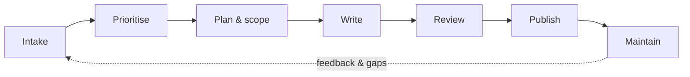

# How I run documentation

This is the operating model I use to plan, produce and maintain documentation for a team that supports many applications and processes. It's how I'd set up documentation as a lead.

## 1. Intake

- One front door for requests: a Jira ticket with a short template – audience, purpose, deadline, SME and related tickets
- Requests from release planning are added automatically for anything user-facing

## 2. Prioritise

I rank requests on three questions:

| Question | Higher priority when… |
|---|---|
| **Impact** | Many users rely on it, or it supports a release, audit or UAT |
| **Risk** | Missing or wrong content could cause errors, rework or compliance issues |
| **Effort** | It can be delivered in one cycle with available SMEs |

## 3. Plan and scope

- Agree the audience and the questions the document must answer
- Choose the right content type – process overview, SOP, reference, release note or FAQ
- Book SME time early; a document without an SME is a guess

## 4. Write

- Start from a **template** for the content type, so pages look and read the same
- Follow a **style guide**: plain language, active voice, task-based headings, consistent terms (see the [glossary](../streams/glossary.md))
- Write for **people and AI search**: one topic per page, descriptive headings, no key facts hidden in images

## 5. Review

| Review | Who | Checks |
|---|---|---|
| Technical | SME or developer | Accuracy and completeness |
| Peer / editorial | Another writer or me | Clarity, structure, style |
| Audience | A target user | Can they complete the task without help? |

## 6. Publish

- Publish in the agreed space, add labels and link the page from its parent process
- Close the Jira ticket with a link to the page
- Announce major changes in release notes or the team channel

## 7. Maintain

- Every page has an **owner** and a **last reviewed** date
- Quarterly review of high-traffic and process pages
- Retire or archive outdated pages rather than leaving them to confuse readers – and AI agents

## How I measure documentation

| Metric | What it tells you |
|---|---|
| Pages published and updated per cycle | Throughput |
| Review turnaround | Where work gets stuck |
| Page views and search terms with no results | What people need and can't find |
| Repeat questions to SMEs or support | Gaps the documentation should close |
| AI agent answers without a source | Missing or unclear content |

## Related documents

- [Case study – Delivering documentation in Agile cycles](agile-delivery.md)
- [Case study – Building a process documentation repository](process-repository.md)
- [Knowledge base for an AI agent](../samples/ai-knowledge-base.md)
