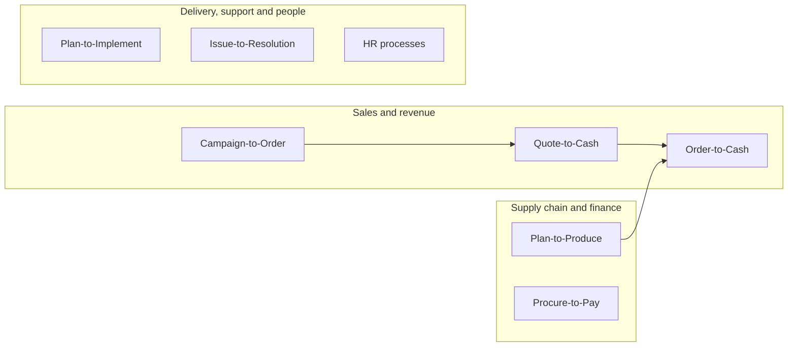

---
hide:
  - navigation
  - toc
---

{ loading=lazy }

# Hi, I'm Avinash Barik

Senior Content Developer · Technical Writer · Enterprise Apps Documentation

I turn complex enterprise systems and business processes into clear, structured documentation – for business users, developers and AI agents.

[View my work :material-arrow-down:](#writing-samples){ .md-button .md-button--primary }
[Contact me :material-email-outline:](about.md#contact){ .md-button }

  
<strong>5+</strong>years in documentation &amp; content

  
<strong>9</strong>enterprise applications documented

  
<strong>8</strong>end-to-end process streams

  
<strong>1</strong>AI knowledge agent built &amp; trained

## What I do

At **Nutanix**, I document the G&A IT business applications stack and the end-to-end process streams that run across it. My Confluence repositories are used by business analysts, QA and product teams for reviews, UAT and onboarding. I also built and trained a **Glean AI agent** that gives delivery teams and business users source-based answers.

  SalesforceNetSuiteBoomiZuoraRevProCoupaWorkdayKinaxisKantata

### Process streams I document

!!! note "About these samples"
    My day-to-day work is internal and confidential, so every sample below is **recreated from scratch** for a fictional company, *Acme Corp*. The structure, style and approach match how I work; the names, data and figures are invented.

## Writing samples

-   :material-sitemap-outline: **Process documentation**

    ---

    An end-to-end Order-to-Cash process with a flow diagram, roles, systems and handoffs.

    [:octicons-arrow-right-24: Order-to-Cash](samples/order-to-cash.md)

-   :material-format-list-numbered: **Standard operating procedure**

    ---

    A step-by-step procedure for raising a purchase request, with prerequisites and troubleshooting.

    [:octicons-arrow-right-24: Purchase request SOP](samples/sop-purchase-request.md)

-   :material-api: **API reference**

    ---

    REST endpoint documentation with authentication, JSON examples and error codes.

    [:octicons-arrow-right-24: Orders API](samples/api-reference.md)

-   :material-robot-outline: **AI documentation**

    ---

    A guide to structuring a knowledge base so an AI agent can retrieve accurate answers.

    [:octicons-arrow-right-24: Knowledge base for AI](samples/ai-knowledge-base.md)

-   :material-new-box: **Release notes**

    ---

    Customer-facing release notes for a SaaS product update.

    [:octicons-arrow-right-24: Release notes](samples/release-notes.md)

-   :material-help-circle-outline: **Knowledge base article**

    ---

    A task-based help article written for end users.

    [:octicons-arrow-right-24: KB article](samples/kb-article.md)

## Case studies

-   :material-folder-network-outline: **Building a process documentation repository**

    ---

    How I planned and structured a Confluence space for multiple business applications and process streams.

    [:octicons-arrow-right-24: Read the case study](case-studies/process-repository.md)

-   :material-brain: **Creating and training an AI knowledge agent**

    ---

    How I set up an enterprise AI agent for delivery teams and business users.

    [:octicons-arrow-right-24: Read the case study](case-studies/ai-agent.md)

## Published work

Public documentation I wrote and published in my previous role:

- [Release notes – February 2024 (InsuredMine)](https://www.insuredmine.com/knowledge-base/release-notes-february-2024/){ target="_blank" } – customer-facing release notes for the InsuredMine insurance agency management platform, published on the InsuredMine knowledge base.

## Tools I work with

| Area | Tools |
|---|---|
| Authoring & docs-as-code | Confluence, Markdown, MkDocs, MadCap Flare, DITA, VS Code, GitHub |
| Project tracking | Jira, Agile / Scrum |
| Enterprise applications | Salesforce, NetSuite, Boomi, Zuora, RevPro, Coupa, Workday, Kinaxis, Kantata |
| AI | Glean, Claude, Gemini, prompt engineering, Model Context Protocol (MCP) |
| API documentation | REST, JSON, XML |

[About me & contact :material-account:](about.md){ .md-button .md-button--primary }
[LinkedIn :fontawesome-brands-linkedin:](https://www.linkedin.com/in/avinash-barik-54a1ab194/){ .md-button target="_blank" }
