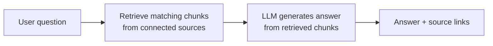

# Writing documentation for an AI knowledge agent

!!! info "Sample document"
    A guide based on my experience creating and training an enterprise AI agent.

AI agents such as Glean, Copilot or a custom LLM assistant don't *read* documentation the way people do. They search for chunks of content that match a question and generate an answer from them. If the source content is vague, duplicated or out of date, the answer will be too.

This guide explains how to write and organize content so that an AI agent gives accurate, source-based answers.

## How an AI agent uses your content

Two things follow from this:

1. **Retrieval decides what the AI knows.** A page that isn't connected, or uses different words from the user's question, won't be found.
2. **Each chunk must make sense on its own.** The agent may only see one section of a page, not the whole page.

## Principles

### One topic per page

Split long pages into focused topics. *"How invoices sync from Billing to ERP"* retrieves better than a 30-page *"Finance Systems Overview"*.

### Descriptive headings

Write headings as the questions people ask.

| Instead of | Write |
|---|---|
| Overview | What the Order-to-Cash process covers |
| Errors | Fixing failed order syncs |
| Misc | Who to contact for billing access |

### Self-contained sections

Repeat key context in each section. Avoid *"as mentioned above"* or *"see the previous step"* – the AI may not have seen them.

### Consistent terminology

Pick one term and use it everywhere. If teams use synonyms, list them once in a glossary, e.g. *"Sales order (also called SO or ERP order)"*.

### Plain text over images

Put important information in text or tables, not only in screenshots or diagrams. Add a text summary under every diagram.

### Clear ownership and dates

Show the owner and last-reviewed date on every page so stale content can be found and fixed.

## Setting up the agent

1. **Connect the right sources** – for example the Confluence space, the Jira project and the team's shared drive. Exclude drafts and archived spaces.
2. **Write instructions for the agent** – describe its audience, scope and tone, and tell it to always cite sources and say *"I don't know"* when no source matches.
3. **Build a test set** – collect 30–50 real questions from users with the expected answer and source page.
4. **Test and improve** – run the test questions, note wrong or missing answers, and fix the *content*, not just the prompt.
5. **Launch and train users** – show users how to ask good questions and how to check the cited source.
6. **Review regularly** – track unanswered questions and turn them into new or improved pages.

## Content checklist

- [ ] Page covers a single topic
- [ ] Headings describe the content or match common questions
- [ ] Each section makes sense on its own
- [ ] Terms match the glossary
- [ ] Diagrams have a text summary
- [ ] Owner and last-reviewed date are shown
- [ ] Outdated versions are archived or removed

## Related documents

- [Case study – Creating and training an AI knowledge agent](../case-studies/ai-agent.md)
- [Knowledge base article example](kb-article.md)
- [Issue-to-Resolution process](../streams/issue-to-resolution.md)
