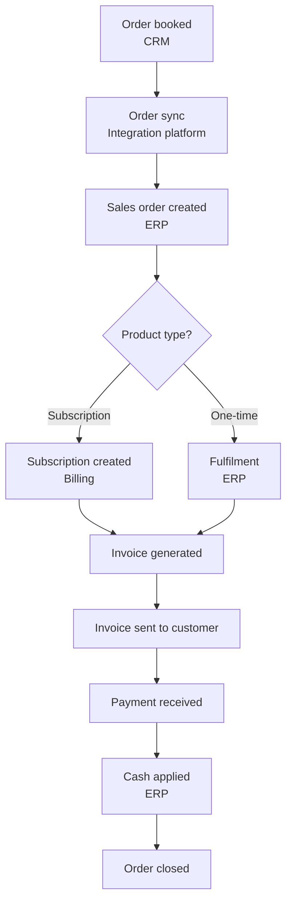
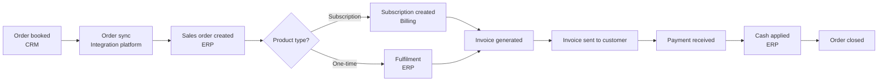

# Order-to-Cash (O2C) process

!!! info "Sample document"
    Fictional company (*Acme Corp*) and data. Written to show how I document an end-to-end business process across integrated enterprise applications.

| Item | Details |
|---|---|
| **Process owner** | Finance Operations |
| **Systems** | CRM (Salesforce), Integration platform (Boomi), ERP (NetSuite), Billing (Zuora) |
| **Audience** | Business analysts, developers, finance users, new joiners |
| **Last reviewed** | Quarterly |

## Overview

Order-to-Cash covers everything from the moment a customer's order is booked to the moment payment is received and applied. At Acme Corp, the process spans four systems. This document explains each stage, who owns it, which system holds the record of truth, and how data moves between systems.

## Scope

**In scope:** booked orders for subscription and one-time products, invoicing, payment collection and cash application.

**Out of scope:** quoting and approvals (see *Quote-to-Cash*), returns and credit memos (see *Issue-to-Resolution*).

## Process flow

## Roles and responsibilities

| Role | Responsibility |
|---|---|
| Sales operations | Books the order in CRM and confirms customer, pricing and billing details |
| Integration support | Monitors order sync jobs and resolves failed transactions |
| Order management | Validates the sales order in ERP and releases it for fulfilment |
| Billing team | Creates subscriptions, generates and sends invoices |
| Accounts receivable | Records payments, applies cash and follows up on overdue invoices |

## Process stages

### 1. Order booking

1. Sales operations marks the opportunity as **Closed Won** in CRM.
2. CRM validates that the account has a billing contact, payment terms and a tax ID.
3. The order is set to **Ready to Sync**.

!!! tip "Common issue"
    Orders without a billing contact fail validation and stay in **Draft**. Ask the account owner to add the contact before resubmitting.

### 2. Order sync

1. The integration platform picks up **Ready to Sync** orders every 15 minutes.
2. It maps CRM fields to ERP fields (see [Field mapping](#field-mapping)).
3. On success, the CRM order shows the ERP sales order number. On failure, an alert goes to the integration support queue.

### 3. Sales order and fulfilment

1. Order management reviews the sales order in ERP.
2. One-time products are released for fulfilment; subscription products are sent to the billing system.

### 4. Invoicing

1. The billing system generates invoices on the billing schedule (monthly, quarterly or annual).
2. Invoices are emailed to the billing contact and posted to ERP.

### 5. Payment and cash application

1. Accounts receivable records incoming payments in ERP.
2. Payments are matched to open invoices. Unmatched payments go to the **Unapplied Cash** queue for review.
3. When all invoices are paid, the order status changes to **Closed**.

## Field mapping

| CRM field | ERP field | Notes |
|---|---|---|
| Account Name | Customer | Must match an existing customer record |
| Order Number | External ID | Used to prevent duplicate orders |
| Billing Contact | Bill-To Contact | Required |
| Payment Terms | Terms | Net 30 by default |
| Order Line – Product Code | Item | Must exist in the ERP item master |

## Controls and KPIs

- **Order sync success rate** – target 99% of orders synced on first attempt
- **Invoice accuracy** – no manual corrections after sending
- **Days Sales Outstanding (DSO)** – tracked monthly by accounts receivable

## Related documents

- Quote-to-Cash process
- Issue-to-Resolution process
- Integration error handling runbook
# Order-to-Cash (O2C) process

!!! info "Sample document"
    Fictional company (*Acme Corp*) and data. Written to show how I document an end-to-end business process across integrated enterprise applications.

| Item | Details |
|---|---|
| **Process owner** | Finance Operations |
| **Systems** | CRM (Salesforce), Integration platform (Boomi), ERP (NetSuite), Billing (Zuora) |
| **Audience** | Business analysts, developers, finance users, new joiners |
| **Last reviewed** | Quarterly |

## Overview

Order-to-Cash covers everything from the moment a customer's order is booked to the moment payment is received and applied. At Acme Corp, the process spans four systems. This document explains each stage, who owns it, which system holds the record of truth, and how data moves between systems.

## Scope

**In scope:** booked orders for subscription and one-time products, invoicing, payment collection and cash application.

**Out of scope:** quoting and approvals (see *Quote-to-Cash*), returns and credit memos (see *Issue-to-Resolution*).

## Process flow

## Roles and responsibilities

| Role | Responsibility |
|---|---|
| Sales operations | Books the order in CRM and confirms customer, pricing and billing details |
| Integration support | Monitors order sync jobs and resolves failed transactions |
| Order management | Validates the sales order in ERP and releases it for fulfilment |
| Billing team | Creates subscriptions, generates and sends invoices |
| Accounts receivable | Records payments, applies cash and follows up on overdue invoices |

## Process stages

### 1. Order booking

1. Sales operations marks the opportunity as **Closed Won** in CRM.
2. CRM validates that the account has a billing contact, payment terms and a tax ID.
3. The order is set to **Ready to Sync**.

!!! tip "Common issue"
    Orders without a billing contact fail validation and stay in **Draft**. Ask the account owner to add the contact before resubmitting.

### 2. Order sync

1. The integration platform picks up **Ready to Sync** orders every 15 minutes.
2. It maps CRM fields to ERP fields (see [Field mapping](#field-mapping)).
3. On success, the CRM order shows the ERP sales order number. On failure, an alert goes to the integration support queue.

### 3. Sales order and fulfilment

1. Order management reviews the sales order in ERP.
2. One-time products are released for fulfilment; subscription products are sent to the billing system.

### 4. Invoicing

1. The billing system generates invoices on the billing schedule (monthly, quarterly or annual).
2. Invoices are emailed to the billing contact and posted to ERP.

### 5. Payment and cash application

1. Accounts receivable records incoming payments in ERP.
2. Payments are matched to open invoices. Unmatched payments go to the **Unapplied Cash** queue for review.
3. When all invoices are paid, the order status changes to **Closed**.

## Field mapping

| CRM field | ERP field | Notes |
|---|---|---|
| Account Name | Customer | Must match an existing customer record |
| Order Number | External ID | Used to prevent duplicate orders |
| Billing Contact | Bill-To Contact | Required |
| Payment Terms | Terms | Net 30 by default |
| Order Line – Product Code | Item | Must exist in the ERP item master |

## Controls and KPIs

- **Order sync success rate** – target 99% of orders synced on first attempt
- **Invoice accuracy** – no manual corrections after sending
- **Days Sales Outstanding (DSO)** – tracked monthly by accounts receivable

## Related documents

- Quote-to-Cash process
- Issue-to-Resolution process
- Integration error handling runbook
