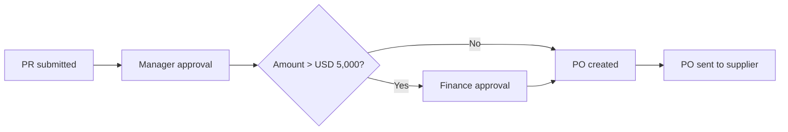

# SOP: Raising a purchase request

!!! info "Sample document"
    Shows how I write a task-based standard operating procedure.

| Item | Details |
|---|---|
| **SOP ID** | PROC-SOP-004 |
| **Applies to** | All Acme Corp employees who buy goods or services |
| **System** | Procurement platform (e.g. Coupa) |
| **Time needed** | About 10 minutes |

## Purpose

This SOP explains how to raise a purchase request (PR) so that purchases are approved, budgeted and paid correctly.

## Before you begin

- [x] You have access to the procurement platform.
- [x] You know the **cost center** your purchase will be charged to.
- [x] For purchases above USD 5,000, you have a vendor quote saved as a PDF.
- [x] The vendor is already set up. If not, raise a *New Vendor Request* first.

## Steps

1. **Sign in** to the procurement platform with your single sign-on (SSO) account.
2. On the home page, select **Create Request**.
3. Choose the request type:

    === "Goods"
        Select **Catalog item** if the item is listed, or **Non-catalog item** to enter it manually.

    === "Services"
        Select **Service request**, then enter the start and end dates of the service.

4. Enter the item details:

    | Field | What to enter |
    |---|---|
    | Description | A short, specific description, e.g. *"Annual license – design software, 10 users"* |
    | Supplier | Search and select the approved vendor |
    | Quantity and unit price | As shown on the vendor quote |
    | Need-by date | The date you need the goods or service |

5. Under **Accounting**, select your **cost center** and **GL account**.
6. Attach the vendor quote under **Attachments**.
7. Select **Submit for approval**.

**Result:** The request moves to **Pending Approval** and you receive an email confirmation with the PR number.

## Approval workflow

## Troubleshooting

| Problem | Cause | What to do |
|---|---|---|
| Supplier not found | Vendor isn't onboarded | Raise a *New Vendor Request* |
| "Invalid cost center" error | Cost center is closed or mistyped | Confirm the cost center with your finance partner |
| Request stuck in approval for 3+ days | Approver is away | Use **Comment** to remind the approver or contact Procurement |

## Related documents

- [Plan-to-Produce process](../streams/plan-to-produce.md)
- [Hire-to-Retire process](../streams/hire-to-retire.md)
- [Knowledge base article example](kb-article.md)
