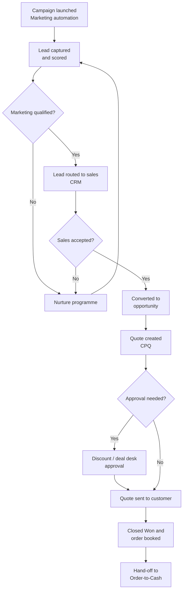

# Campaign-to-Order (C2O) process

!!! info "Process documentation sample"
    Shows how I document a marketing-to-sales process that spans marketing automation, CRM and CPQ.

| Item | Details |
|---|---|
| **Process owner** | Marketing Operations and Sales Operations |
| **Systems** | Marketing automation, CRM (Salesforce), CPQ, Integration platform (Boomi), ERP (NetSuite) |
| **Audience** | Marketing ops, sales ops, business analysts, new joiners |
| **Last reviewed** | Quarterly |

## Overview

Campaign-to-Order covers the journey from a marketing campaign to a booked order. It explains how a response to a campaign becomes a lead, how the lead is qualified and converted, how the opportunity is quoted and approved, and how the won deal is handed off to Order-to-Cash.

## Scope

**In scope:** campaign setup, lead capture and scoring, lead routing, qualification, opportunity management, quoting and approvals, and order booking.

**Out of scope:** invoicing and payment collection (see [Order-to-Cash](../samples/order-to-cash.md)), and partner deal registration.

## Process flow

## Roles and responsibilities

| Role | Responsibility |
|---|---|
| Marketing operations | Builds campaigns, manages lead scoring rules and syncs leads to CRM |
| Sales development (SDR) | Works marketing-qualified leads and accepts or rejects them |
| Account executive | Owns the opportunity, builds the quote and closes the deal |
| Deal desk | Reviews non-standard pricing, discounts and terms |
| Sales operations | Maintains routing rules, validates booked orders and supports CRM users |

## Process stages

### 1. Campaign setup

1. Marketing operations creates the campaign in the marketing automation platform and the matching **Campaign** record in CRM.
2. Campaign member statuses (for example *Registered*, *Attended*, *Responded*) are defined so responses can be reported on.

### 2. Lead capture and scoring

1. Form fills, event lists and content downloads create or update leads.
2. Each lead gets a **behaviour score** (engagement) and a **fit score** (company size, region, industry).
3. Leads that cross the threshold become **Marketing Qualified Leads (MQLs)** and sync to CRM.

### 3. Routing and qualification

1. Assignment rules route the MQL to the right SDR by territory and segment.
2. The SDR contacts the lead and marks it **Sales Accepted** or returns it to nurture with a reason code.

!!! tip "Common issue"
    Leads with a missing country or company size can't be routed and land in the **Unassigned** queue. Sales ops reviews this queue daily.

### 4. Opportunity and quote

1. The lead is converted to an account, contact and opportunity, and the campaign is attributed to the opportunity.
2. The account executive builds a quote in CPQ from the product catalogue.
3. Quotes above the discount threshold go to the deal desk for approval.

### 5. Order booking and hand-off

1. When the customer signs, the opportunity is set to **Closed Won** and the order is booked.
2. The order syncs to ERP through the integration platform and the process continues in Order-to-Cash.

## Key data handoffs

| From | To | Data | Trigger |
|---|---|---|---|
| Marketing automation | CRM | Lead, score, campaign response | Lead reaches MQL threshold |
| CRM | CPQ | Account, opportunity, price book | Quote created |
| CPQ | CRM | Quote lines, approved pricing | Quote approved |
| CRM | ERP (via integration platform) | Order, customer, billing details | Opportunity Closed Won |

## Controls and KPIs

- **MQL-to-SQL conversion rate** – share of marketing-qualified leads accepted by sales
- **Lead response time** – time from MQL to first sales touch
- **Campaign-influenced pipeline** – opportunity value attributed to campaigns
- **Quote approval cycle time** – time from quote submission to approval

## Related documents

- [Order-to-Cash process](../samples/order-to-cash.md)
- Lead routing rules reference
- Quote approval matrix
