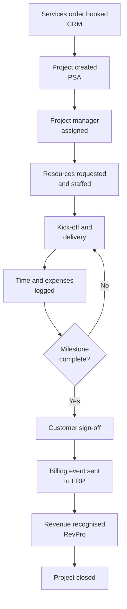

# Delivery Apps – Project-to-Delivery process

!!! info "Process documentation sample"
    Shows how I document the applications and process used to deliver professional services projects, from sold deal to billed project.
    It mirrors the structure of my real process documentation at Nutanix, with company-specific details made generic for confidentiality.

| Item | Details |
|---|---|
| **Process owner** | Professional Services Operations |
| **Systems** | CRM (Salesforce), Professional services automation – PSA (Kantata), Integration platform (Boomi), ERP (NetSuite), Revenue recognition (RevPro) |
| **Audience** | Delivery managers, project managers, consultants, finance users, business analysts |
| **Version** | 2.1 · Published |
| **Approvers** | Process owner, lead business analyst |
| **Last reviewed** | Quarterly |

## Overview

When a customer buys professional services – such as installation, migration or consulting – the delivery apps turn the sold services into a project, staff it, track time and milestones, and pass billing and revenue data to finance. This document explains how a services deal moves from CRM into the PSA tool and on to ERP and revenue systems.

## Scope

**In scope:** project creation from a booked services order, resourcing, project execution, time and expense tracking, milestone completion, billing and revenue events.

**Out of scope:** pre-sales scoping (see [Campaign-to-Order](campaign-to-order.md)) and customer support cases after go-live (see [Issue-to-Resolution](issue-to-resolution.md)).

## Process flow

## Roles and responsibilities

| Role | Responsibility |
|---|---|
| Services operations | Confirms project creation, templates and rate cards |
| Project manager | Plans the project, manages scope, milestones and customer sign-off |
| Resource manager | Matches consultants to requests based on skills and availability |
| Consultant | Delivers the work and logs time and expenses |
| Finance / revenue team | Bills milestones and recognises services revenue |

## Process stages

### 1. Project creation

1. When an order with services SKUs is booked in CRM, the integration platform creates a project in the PSA tool.
2. The project is built from a template that matches the service type, with default phases, tasks and milestones.

### 2. Resourcing

1. The project manager submits resource requests with role, skills, dates and hours.
2. The resource manager assigns named consultants and confirms the schedule.

### 3. Delivery and time tracking

1. Consultants log time against project tasks every week; expenses are submitted with receipts.
2. Project managers approve timesheets and track budget burn against the plan.

!!! tip "Common issue"
    Time logged to a closed phase is rejected. Ask the project manager to reopen the phase or move the time to the correct task.

### 4. Milestones and billing

1. When a milestone is complete, the customer signs off and the project manager marks it **Complete**.
2. Fixed-fee milestones and approved time and materials sync to ERP as billing events.

### 5. Revenue and closure

1. Revenue events flow to the revenue recognition system based on the contract's performance obligations.
2. When all milestones are billed, the project manager closes the project and records lessons learned.

## Key data handoffs

| From | To | Data | Trigger |
|---|---|---|---|
| CRM | PSA | Services order lines, account, contract value | Order booked |
| PSA | ERP | Approved time, expenses, milestone billing | Timesheet approval / milestone complete |
| ERP | Revenue recognition | Billing and fulfilment events | Invoice posted |

## Controls and KPIs

- **Utilisation** – billable hours as a share of available hours
- **Time-to-staff** – days from project creation to resources assigned
- **Budget variance** – actual vs planned hours and cost
- **Milestone billing lag** – days from milestone completion to invoice

## Related documents

- [Order-to-Cash process](../samples/order-to-cash.md)
- [Campaign-to-Order process](campaign-to-order.md)
- [Issue-to-Resolution process](issue-to-resolution.md)
