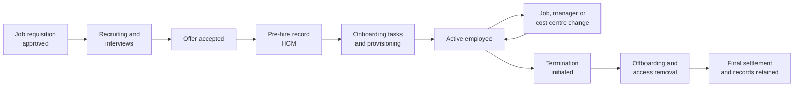

# Hire-to-Retire (H2R) process

!!! info "Process documentation sample"
    Shows how I document an end-to-end HR process and the integrations that give employees access to the systems they need.

| Item | Details |
|---|---|
| **Process owner** | People Operations (HR) |
| **Systems** | HCM (Workday), Integration platform (Boomi), identity and access management, ERP (NetSuite), Procurement (Coupa), CRM (Salesforce) |
| **Audience** | HR operations, IT, business analysts, people managers, new joiners |
| **Last reviewed** | Quarterly |

## Overview

Hire-to-Retire covers the employee lifecycle – from an approved job requisition to an employee's exit. Workday is the system of record for people data; worker changes flow to downstream systems so access, approvals and cost centres stay correct throughout the employee's time at the company.

## Scope

**In scope:** requisition and recruiting, offer, pre-boarding and onboarding, job and organisation changes, compensation events, and offboarding.

**Out of scope:** payroll calculation and benefits administration (handled by the payroll provider), and performance management content.

## Process flow

## Roles and responsibilities

| Role | Responsibility |
|---|---|
| Hiring manager | Raises the requisition, interviews and approves the offer |
| Recruiter | Manages candidates and extends offers |
| HR operations | Completes hire, change and termination transactions in HCM |
| IT / identity team | Provisions and removes accounts and equipment |
| Business systems | Maintains worker integrations to downstream applications |

## Process stages

### 1. Requisition and recruiting

1. The hiring manager creates a requisition in HCM; it is approved against budget and headcount.
2. Recruiters post the role, manage candidates through interview stages and extend the offer.

### 2. Pre-boarding and onboarding

1. When the offer is accepted, the candidate becomes a pre-hire and HR completes the hire transaction.
2. The new worker record syncs to identity management to create accounts, and to finance and procurement systems as an employee with a manager and cost centre.
3. Onboarding tasks (documents, equipment, training) are assigned and tracked in HCM.

### 3. Employee changes

1. Job, manager, location and cost centre changes are entered as business processes in HCM and routed for approval.
2. Approved changes sync downstream so approval hierarchies in procurement and finance stay current.

!!! tip "Common issue"
    If a manager change isn't approved before the integration runs, purchase requests still route to the old manager. Complete approvals before the daily sync.

### 4. Offboarding

1. The manager or HR initiates the termination with the last working day.
2. On the effective date, access is disabled, equipment is collected and open approvals are reassigned.
3. Records are retained according to the data retention policy.

## Key integrations

| From | To | Data | Trigger |
|---|---|---|---|
| HCM | Identity management | New hire, changes, terminations | Daily and on effective date |
| HCM | ERP | Employee, department, cost centre | Daily |
| HCM | Procurement | Employee, manager hierarchy, approval limits | Daily |
| HCM | CRM | User and role for sales and support staff | On hire / change |

## Controls and KPIs

- **Time to hire** – requisition approval to offer acceptance
- **Day-one readiness** – new joiners with accounts and equipment on day one
- **Access removal time** – termination effective date to access disabled
- **Integration error rate** – failed worker syncs per month

## Related documents

- [Raising a purchase request (SOP)](../samples/sop-purchase-request.md)
- New joiner onboarding checklist
- Worker integration error handling runbook
