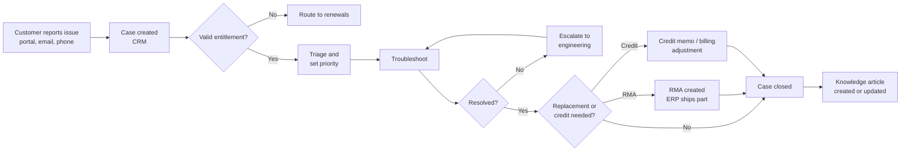

# Issue-to-Resolution (I2R) process

!!! info "Process documentation sample"
    Shows how I document a customer support process, from case creation to resolution, returns and credits.

| Item | Details |
|---|---|
| **Process owner** | Customer Support Operations |
| **Systems** | CRM / service cloud (Salesforce), Knowledge base, Integration platform (Boomi), ERP (NetSuite), Billing (Zuora) |
| **Audience** | Support engineers, support operations, finance users, business analysts |
| **Last reviewed** | Quarterly |

## Overview

Issue-to-Resolution covers how a customer issue is logged, triaged, worked and closed. It also covers the follow-on steps when the fix needs a hardware replacement (RMA), a credit memo or a billing adjustment, so support, operations and finance work from the same record.

## Scope

**In scope:** case creation, entitlement check, triage and priority, troubleshooting and escalation, return material authorisation (RMA), credits and billing adjustments, case closure and knowledge capture.

**Out of scope:** new sales and renewals (see [Campaign-to-Order](campaign-to-order.md)) and project-based services (see [Delivery Apps](delivery-apps.md)).

## Process flow

## Roles and responsibilities

| Role | Responsibility |
|---|---|
| Support engineer | Owns the case, troubleshoots and communicates with the customer |
| Escalation engineer | Handles complex or high-priority issues and engages engineering |
| Support operations | Maintains queues, entitlement rules and SLA settings |
| Logistics / supply chain | Ships replacement parts and receives returns for RMAs |
| Billing / AR team | Issues credit memos and billing adjustments |

## Process stages

### 1. Case creation and entitlement

1. Cases are created from the customer portal, email-to-case or by phone.
2. CRM checks the customer's entitlement (active support contract and asset) and sets the SLA.

### 2. Triage and priority

| Priority | Definition | First response target |
|---|---|---|
| P1 – Critical | Production down, no workaround | 1 hour |
| P2 – High | Major function impaired | 4 hours |
| P3 – Medium | Minor impact, workaround available | 1 business day |
| P4 – Low | Question or cosmetic issue | 2 business days |

### 3. Troubleshooting and escalation

1. The engineer searches the knowledge base and similar cases before troubleshooting.
2. Unresolved P1/P2 cases are escalated to engineering with logs and reproduction steps.

### 4. RMA, credits and adjustments

1. If hardware is faulty, the engineer raises an RMA. It syncs to ERP, which ships the replacement and tracks the return.
2. If the customer is owed money, a credit request is created and approved; finance issues the credit memo or adjusts the subscription in billing.

!!! tip "Common issue"
    An RMA can't be created for an asset that isn't linked to the account. Ask support operations to fix the asset record first.

### 5. Closure and knowledge capture

1. The case is closed when the customer confirms the fix or after the agreed waiting period.
2. If the solution isn't already documented, the engineer creates or updates a knowledge article.

## Controls and KPIs

- **First response time** and **time to resolution** against SLA by priority
- **First contact resolution rate**
- **Customer satisfaction (CSAT)** after case closure
- **RMA cycle time** – from RMA creation to part delivered

## Related documents

- [Order-to-Cash process](../samples/order-to-cash.md)
- [Knowledge base article example](../samples/kb-article.md)
- Escalation matrix
