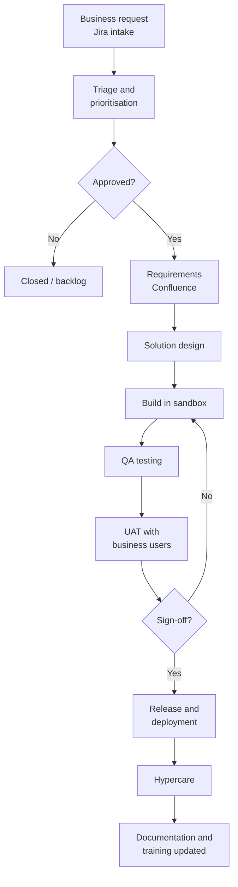

# Plan-to-Implement process

!!! info "Process documentation sample"
    Shows how I document the delivery lifecycle that business systems teams follow to plan, build and release changes to enterprise applications.

| Item | Details |
|---|---|
| **Process owner** | Business Systems / IT PMO |
| **Systems** | Jira, Confluence, application sandboxes (Salesforce, NetSuite, Workday and others), Integration platform (Boomi) |
| **Audience** | Business analysts, developers, QA, product owners, business stakeholders |
| **Last reviewed** | Quarterly |

## Overview

Plan-to-Implement describes how a business request becomes a released change in an enterprise application. It covers intake and prioritisation, requirements, design, build, testing, user acceptance testing (UAT), deployment and hypercare, and the documentation produced at each step.

## Scope

**In scope:** enhancement requests and projects for business applications and integrations, from intake to post-release support.

**Out of scope:** break-fix incidents (handled through the support queue) and infrastructure changes.

## Process flow

## Roles and responsibilities

| Role | Responsibility |
|---|---|
| Business stakeholder | Raises the request, joins UAT and signs off |
| Product owner / PMO | Prioritises the backlog and plans releases |
| Business analyst | Gathers requirements and writes user stories and acceptance criteria |
| Developer | Designs and builds the change in a sandbox |
| QA | Tests the change and logs defects |
| Technical writer | Updates process docs, SOPs, release notes and training material |

## Process stages

### 1. Intake and prioritisation

1. Requests are logged as Jira tickets with business justification, impacted applications and urgency.
2. The PMO reviews requests weekly and scores them for value and effort.

### 2. Requirements and design

1. The business analyst runs discovery sessions and documents requirements in Confluence, linked to the Jira epic.
2. The solution design records impacted objects, integrations, data changes and security.

### 3. Build and test

1. Developers build in a sandbox and link commits or change sets to the Jira story.
2. QA runs functional and regression tests; defects are logged and fixed before UAT.

### 4. UAT and sign-off

1. Business users test against UAT scripts in a full-copy sandbox.
2. Sign-off is recorded on the Jira ticket before the change is scheduled for release.

!!! tip "Documentation checkpoint"
    UAT can't start until the updated process document and SOP are linked to the epic, so testers follow the same steps users will.

### 5. Release and hypercare

1. Approved changes are deployed in the scheduled release window, following the deployment checklist.
2. During hypercare (usually two weeks), the project team monitors issues and answers user questions.
3. Release notes are published and the knowledge base is updated.

## Documentation produced

| Stage | Artefacts |
|---|---|
| Requirements | Business requirements, user stories, acceptance criteria |
| Design | Solution design, integration specification, data mapping |
| Testing | Test cases, UAT scripts, sign-off record |
| Release | Release notes, deployment checklist, updated SOPs and process flows |

## Controls and KPIs

- **Lead time** – from approved request to release
- **Defects found in UAT vs production**
- **Release success rate** – releases without rollback
- **Documentation completeness** – epics with linked, up-to-date docs at release

## Related documents

- [Building a process documentation repository](../case-studies/process-repository.md)
- [Release notes example](../samples/release-notes.md)
- Deployment checklist
