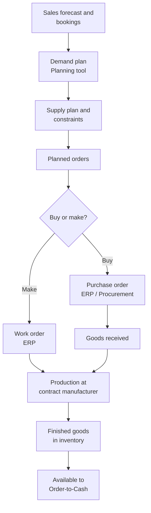

# Plan-to-Produce process

!!! info "Process documentation sample"
    Shows how I document a supply chain process from demand planning to finished goods, across planning, procurement and ERP systems.

| Item | Details |
|---|---|
| **Process owner** | Supply Chain Operations |
| **Systems** | Supply chain planning (Kinaxis), ERP (NetSuite), Procurement (Coupa), Integration platform (Boomi) |
| **Audience** | Demand and supply planners, buyers, manufacturing operations, business analysts |
| **Last reviewed** | Quarterly |

## Overview

Plan-to-Produce covers how the company forecasts demand, plans supply, buys components and builds finished products. Planning happens in the supply chain planning tool; execution – purchase orders, work orders and inventory – happens in ERP and the procurement system.

## Scope

**In scope:** demand forecasting, supply planning, material requirements, purchase orders to suppliers and contract manufacturers, work orders, goods receipt and inventory updates.

**Out of scope:** indirect (non-production) purchasing (see [Raising a purchase request](../samples/sop-purchase-request.md)) and customer order fulfilment (see [Order-to-Cash](../samples/order-to-cash.md)).

## Process flow

## Roles and responsibilities

| Role | Responsibility |
|---|---|
| Demand planner | Builds and reviews the demand forecast with sales and finance |
| Supply planner | Balances demand against capacity and inventory, releases planned orders |
| Buyer | Converts planned orders to purchase orders and manages suppliers |
| Manufacturing operations | Manages work orders with contract manufacturers |
| Inventory control | Records receipts, transfers and cycle counts in ERP |

## Process stages

### 1. Demand planning

1. Bookings history and the sales forecast are loaded into the planning tool.
2. Planners review the statistical forecast, apply adjustments and publish the consensus demand plan monthly.

### 2. Supply planning

1. The planning tool nets demand against on-hand inventory, open orders and lead times.
2. It generates planned purchase and work orders and flags constraints (capacity, shortages).

### 3. Procurement

1. Approved planned purchase orders are sent to ERP and the procurement system.
2. Buyers confirm quantities, prices and delivery dates with suppliers.

!!! tip "Common issue"
    A planned order fails to convert if the item has no approved supplier in ERP. Ask the buyer to add the supplier to the item record.

### 4. Production

1. Work orders are released to the contract manufacturer with the bill of materials.
2. Component consumption and finished quantities are reported back to ERP.

### 5. Receipt and inventory

1. Finished goods are received into inventory and become available to promise.
2. Actual receipts flow back to the planning tool for the next planning cycle.

## Key data handoffs

| From | To | Data | Frequency |
|---|---|---|---|
| ERP | Planning tool | Inventory, open POs, work orders, bookings | Daily |
| Planning tool | ERP | Planned and rescheduled orders | Daily / on release |
| ERP | Procurement | Approved purchase orders | On release |
| Procurement | ERP | Supplier confirmations, receipts, invoices | On event |

## Controls and KPIs

- **Forecast accuracy** – forecast vs actual demand
- **On-time delivery from suppliers**
- **Inventory turns** and **days of supply**
- **Shortage count** – items below safety stock

## Related documents

- [SOP – Raising a purchase request](../samples/sop-purchase-request.md)
- [Order-to-Cash process](../samples/order-to-cash.md)
- [Plan-to-Implement process](plan-to-implement.md)
